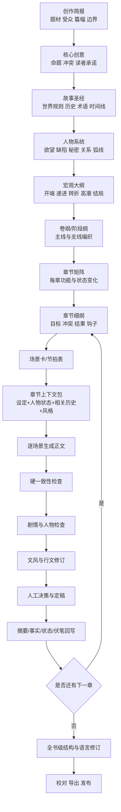
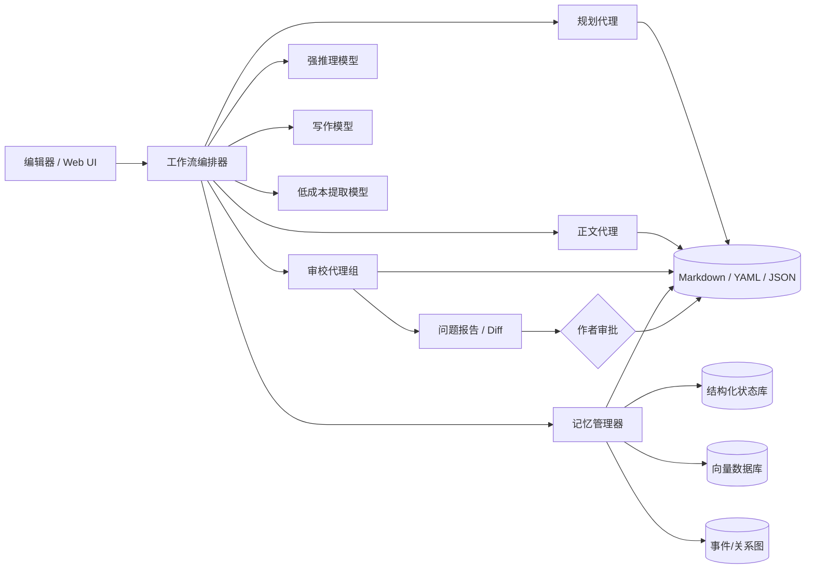

# AI 写小说的主流工作流程与工程化实践（2026 版）

> 调研日期：2026-07-29  
> 更新说明：本版在保留原有调研、流程与模板的基础上，增补“基于 Codex Skills 搭建小说创作工作流”的工程化方案，重点覆盖设定管理、时间线梳理、线索管理和文笔编辑。  
> 适用范围：网络小说、类型文学、长篇小说、系列小说，以及需要持续保持人物、世界观和伏笔一致性的 AI 辅助创作  
> 核心结论：**当前较可靠的 AI 小说创作方式，不是让模型一次性“写完整本书”，而是把创作拆成分层规划、结构化资产、章节级生产、记忆回写、质量审校和全书修订六个系统。**

---

## 目录

1. [结论先行：主流 AI 小说工作流是什么](#1-结论先行主流-ai-小说工作流是什么)
2. [为什么“一条提示词写整本小说”通常会失败](#2-为什么一条提示词写整本小说通常会失败)
3. [完整工作流总览](#3-完整工作流总览)
4. [阶段 0：明确项目目标与创作边界](#4-阶段-0明确项目目标与创作边界)
5. [阶段 1：创意立项、核心命题与读者承诺](#5-阶段-1创意立项核心命题与读者承诺)
6. [阶段 2：建立小说设定集与故事圣经](#6-阶段-2建立小说设定集与故事圣经)
7. [阶段 3：人物角色系统](#7-阶段-3人物角色系统)
8. [阶段 4：宏观大纲设计](#8-阶段-4宏观大纲设计)
9. [阶段 5：卷纲、阶段纲与情节线编织](#9-阶段-5卷纲阶段纲与情节线编织)
10. [阶段 6：章节拆分与章节细纲](#10-阶段-6章节拆分与章节细纲)
11. [阶段 7：场景拆分与节拍设计](#11-阶段-7场景拆分与节拍设计)
12. [阶段 8：为每章组装“上下文包”](#12-阶段-8为每章组装上下文包)
13. [阶段 9：正文生成](#13-阶段-9正文生成)
14. [阶段 10：章节完成后的记忆回写](#14-阶段-10章节完成后的记忆回写)
15. [阶段 11：章节质量检查与修订](#15-阶段-11章节质量检查与修订)
16. [阶段 12：全书级修订](#16-阶段-12全书级修订)
17. [文风、文笔和“去 AI 感”规约](#17-文风文笔和去-ai-感规约)
18. [可直接使用的数据模板](#18-可直接使用的数据模板)
19. [可直接使用的提示词模板](#19-可直接使用的提示词模板)
20. [三种落地方案](#20-三种落地方案)
21. [推荐的工程架构](#21-推荐的工程架构)
22. [开源 GitHub 方案对照](#22-开源-github-方案对照)
23. [最小可行 SOP](#23-最小可行-sop)
24. [常见失败模式与修复方法](#24-常见失败模式与修复方法)
25. [研究依据与参考资料](#25-研究依据与参考资料)

---

## 1. 结论先行：主流 AI 小说工作流是什么

综合当前长篇故事生成研究、商业写作工具和开源项目，可以把较成熟的 AI 小说创作流程概括为：

> **创作简报 → 故事圣经 → 人物与世界观 → 宏观大纲 → 卷纲/阶段纲 → 章节矩阵 → 章节细纲 → 场景卡 → 上下文组装 → 场景级正文 → 连贯性审校 → 文风修订 → 状态回写 → 下一章 → 全书修订**

这个流程的关键不是“拆得越细越好”，而是解决四个长期问题：

1. **全局方向问题**：故事是否持续兑现最初的题材承诺、主题和主线。
2. **局部写作问题**：当前场景是否有目标、冲突、变化和可读性。
3. **长期一致性问题**：人物状态、时间线、物品、秘密、规则和伏笔是否前后一致。
4. **语言质量问题**：正文是否具有稳定的叙事声音，而不是均匀、解释性过强的通用 AI 文风。

当前研究中常见的技术路线包括：

- **层级大纲**：从故事级、卷级、章节级逐层展开。
- **动态规划**：不把早期大纲视为不可更改，而是在每章后重新评估后续计划。
- **双层记忆**：近期章节保留较详细文本，远期内容压缩为摘要、事件和状态。
- **检索增强生成（RAG）**：每章只召回与当前人物、地点、线索有关的历史资料。
- **知识图谱或状态表**：记录人物关系、物品归属、事件时间和因果边。
- **多角色审校**：把“作者”“连续性编辑”“剧情编辑”“文风编辑”分开。
- **生成后回写**：正文一旦改变事实，必须同步更新人物、世界、时间线和伏笔账本。

这与 DOME、StoryWriter、Re3、DOC、Ex3、CritiCS 等长篇生成研究，以及 Sudowrite Story Bible、NovelAI Lorebook、Novelcrafter Codex 等工具体现出的实践方向基本一致。

### 1.1 增补结论：四项核心能力与 Codex Skills 落地

上一轮讨论进一步确认，以下四项并非附属功能，而是长篇小说工程中需要独立维护的核心子系统：

1. **设定管理**：维护故事圣经、正史状态、设定依赖、角色知识边界和设定变更影响。
2. **时间线梳理**：同时记录客观发生时间、正文叙述顺序、角色得知时间、事件持续时间、移动耗时和因果前置。
3. **线索管理**：管理线索的种植、推进、误导、兑现和作废，并区分“客观真相、角色认知、读者认知”。
4. **文笔编辑**：以 Style Bible 和人物语言指纹为约束，先诊断、再选择性修改，避免无目标地整章润色。

这四项能力可以在 Codex 中基于 Skills 落地。推荐的职责划分是：

> **Skill 负责规定操作流程；小说项目文件负责保存权威状态；Python/Node.js 脚本负责确定性查询与校验；模型负责规划、创作、语义判断和提出修订方案。**

因此，合理的 Codex 小说系统不是“一个巨大提示词”或“一个万能写作 Skill”，而是“一个总控 Skill + 多个单职能 Skill + 结构化资料库 + 校验脚本 + Git 版本管理”。

需要始终遵守三条原则：

- **写作可以是生成式的，状态管理应尽量确定性。**
- **审校可以并行，正文和正史修改应串行。**
- **AI 可以提出正史变更，但不能在没有审批的情况下悄悄提交正史变更。**

---

## 2. 为什么“一条提示词写整本小说”通常会失败

### 2.1 上下文窗口大，不等于模型真正掌握全书

即使模型可以读取很长的上下文，也仍可能出现：

- 注意力集中于开头和结尾，忽略中段细节；
- 能复述某项设定，却不能在正确时间应用；
- 记住人物“是谁”，但忘记人物“此刻知道什么”；
- 记住伏笔，却在没有因果铺垫时生硬回收；
- 因上下文塞入过多无关资料，反而降低当前场景质量。

因此，长篇创作不能只依赖“大上下文”，还需要**选择性检索、状态压缩和结构化事实**。

### 2.2 模型善于局部续写，不天然善于长程规划

语言模型逐词生成时，更容易选择“当前看起来顺畅”的后续，而不是“十章以后最有价值”的后续。常见后果是：

- 冲突过早解决；
- 每章都像一个独立短篇；
- 反派不断临时加码，却缺乏统一战略；
- 伏笔只负责制造神秘感，没有回收方案；
- 中段情节反复执行“发现线索—遇袭—逃脱”；
- 人物弧线停留在口头反省，没有行为变化。

### 2.3 AI 容易把“合理”写成“平均”

未经规约的模型通常偏向：

- 四平八稳的句式；
- 情绪和动作被解释两遍；
- 每个角色都说完整、得体、信息充分的话；
- 段落长度和节奏过于均匀；
- 比喻来自通用词库，而不是角色经验；
- 冲突后立即总结意义；
- 强行给每个场景一个温和、完整的小结。

这类文本未必有语病，却往往缺乏作者性、摩擦感和具体生活纹理。

### 2.4 仅靠固定大纲也不够

完全不做规划会漂移，但大纲过度刚性也会造成：

- 人物为了完成节点而失去能动性；
- 新写出的精彩细节无法反作用于后续；
- 早期规划中的低质量桥段被机械执行；
- “完成大纲”优先于“场景真实”。

更合理的方法是：**大方向稳定，局部计划滚动更新**。主线承诺、结局逻辑和关键回收点相对稳定；章节顺序、冲突手段、人物选择可以根据已经写出的内容调整。

---

## 3. 完整工作流总览



建议把系统理解为三个相互耦合的循环：

### 3.1 规划循环

大纲不是一次完成，而是：

> 规划后续若干章 → 写完一章 → 发现新事实和更优方向 → 校正局部计划

### 3.2 章节生产循环

> 章节目标 → 场景设计 → 正文草稿 → 检查 → 修订 → 定稿

### 3.3 记忆循环

> 读取相关历史 → 生成新内容 → 提取新增事实 → 更新状态 → 服务下一章

---

## 4. 阶段 0：明确项目目标与创作边界

在让 AI 产出设定前，先写一份一至两页的“创作简报”。这是整个项目的最高层约束。

### 4.1 创作简报应包含什么

| 字段 | 需要回答的问题 |
|---|---|
| 小说类型 | 玄幻、科幻、悬疑、言情、历史、现实、轻小说，还是混合类型？ |
| 目标读者 | 年龄、阅读习惯、对复杂度和节奏的预期是什么？ |
| 载体 | 长篇出版小说、网络连载、短篇合集、互动小说？ |
| 预计规模 | 总字数、卷数、章节数、单章字数区间？ |
| 核心卖点 | 读者为什么要继续看，而不是去看同类作品？ |
| 情绪体验 | 惊奇、压迫、爽感、浪漫、悲怆、治愈、智斗中的哪些是主导？ |
| 叙事方式 | 第一/第三人称，单/多视角，过去/现在时，叙述距离？ |
| 内容边界 | 禁止出现什么？哪些内容必须谨慎处理？ |
| 创作自主权 | 哪些决定必须由人做，哪些允许 AI 自行补全？ |
| 成功标准 | 完成度、更新速度、商业可读性、文学性、创新性如何排序？ |

### 4.2 建议设置三类约束

**硬约束**：不可违反，例如主角不能复活、魔法不能创造永久物质、全书只使用单一视角。

**软约束**：通常遵守，但必要时可修改，例如每章 3000～4500 字、每五章一次阶段高潮。

**待探索项**：暂时不决定，保留创作空间，例如幕后黑手的具体身份、配角是否牺牲。

这样可避免模型把所有早期猜想都误认为不可更改的“正史”。

---

## 5. 阶段 1：创意立项、核心命题与读者承诺

### 5.1 不要从“世界观百科”开始

很多 AI 小说项目一开始生成数万字设定，却没有故事发动机。更有效的顺序是先回答：

1. 谁想要什么？
2. 为什么现在必须行动？
3. 什么力量阻止他？
4. 失败会失去什么？
5. 这个矛盾为什么能够支撑长篇？
6. 读者持续得到什么体验？

### 5.2 建议产出六个核心对象

#### 一句话梗概

结构可以是：

> 当【触发事件】发生后，【有缺陷的主人公】必须【完成困难目标】，否则【不可逆代价】；但【对抗力量】迫使其面对【内在问题】。

#### 核心戏剧问题

例如：

> 一个只能通过篡改他人记忆生存的人，能否在不抹杀所爱之人的前提下推翻记忆政权？

它应贯穿全书，并在结局得到明确回答。

#### 主题命题

主题不是一句正确口号，而是一组可争论的命题。例如：

- 自由是否必须以承担后果为前提？
- 记忆构成人的身份，还是选择构成人的身份？
- 保护是否可能演变为控制？

最好为不同主要角色分配不同答案，让主题通过冲突展现。

#### 读者承诺

“读者承诺”是作品反复交付的体验。例如：

- 每个案件都揭开世界历史的一层谎言；
- 每次升级都要求主角牺牲一种人性能力；
- 每卷解决一个局部危机，同时暴露更大的制度问题；
- 战斗不仅比力量，还比对规则的理解。

#### 核心差异点

要求 AI 对同题材常见做法做对照：

| 同类常见方案 | 本作方案 | 由此产生的剧情价值 |
|---|---|---|
| 魔法由能量驱动 | 魔法由社会契约驱动 | 每次施法都会改变权利关系 |
| 主角升级获得更多能力 | 主角升级必须永久放弃一种记忆 | 成长与身份危机绑定 |

#### 结局方向

不必一开始写死所有细节，但应知道：

- 主角最终获得什么、失去什么；
- 核心戏剧问题的答案；
- 最大伏笔如何回收；
- 主题通过什么选择落地；
- 结局是封闭、开放还是系列钩子。

---

## 6. 阶段 2：建立小说设定集与故事圣经

“故事圣经”不是百科全书，而是**创作时需要反复引用的权威事实库**。

### 6.1 建议的设定集结构

```text
01_bible/
├── project_brief.md
├── premise_and_theme.md
├── canon_rules.md
├── timeline.md
├── glossary.md
├── factions.md
├── locations.md
├── technology_or_magic.md
├── society_and_economy.md
├── history.md
├── open_questions.md
└── forbidden_contradictions.md
```

### 6.2 每条设定应包含四层信息

1. **事实**：规则是什么。
2. **叙事用途**：它为故事制造什么冲突或选择。
3. **限制与代价**：为什么角色不能随意解决问题。
4. **可见证据**：读者通过什么场景感知这项规则。

例如：

```yaml
设定: 时间回溯
事实: 施术者只能回到自己亲历过的时刻
代价: 每回溯一分钟，永久遗失一段同等长度的自传体记忆
限制: 无法改变施术前未观察到的事件
叙事用途:
  - 强迫主角在救人和保留身份之间选择
  - 防止回溯成为万能解法
展示方式:
  - 主角救下妹妹后忘记两人共同生活的细节
  - 敌人利用主角的观察盲区布置陷阱
```

### 6.3 设定必须按“正史状态”管理

建议使用以下标记：

- `CANON`：正文已经确认，不得随意修改。
- `PLANNED`：计划采用，但尚未进入正文。
- `RUMOR`：世界内角色相信，不保证真实。
- `SECRET`：真实但仅部分角色知道。
- `RETIRED`：旧方案，禁止继续使用。
- `UNKNOWN`：刻意保留，等待后续决定。

这能避免 AI 将“角色误解”“作者备选方案”和“客观事实”混为一谈。

### 6.4 世界观设计的检查问题

- 规则是否有边界、成本和例外？
- 权力如何分配，谁从当前制度获益？
- 普通人的日常生活如何受规则影响？
- 资源如何生产、交换、垄断？
- 技术或魔法是否会改变战争、法律、医疗、家庭和宗教？
- 不同群体是否对同一历史有不同叙述？
- 世界是否只为主角服务，还是存在独立运行的力量？
- 每个重要设定是否至少对应一个剧情冲突？

---

## 7. 阶段 3：人物角色系统

人物卡不能只写“性格冷酷但内心温柔”。它需要支持剧情决策、语言生成和长期状态追踪。

### 7.1 核心人物卡

```yaml
id: char_protagonist
姓名: 林澈
剧情角色: 主人公 / 失忆调查员
外在目标: 找到导致城市集体失忆的源头
内在需要: 接受身份来自持续选择，而非完整记忆
初始错误信念: 失去记忆就等于失去自我
核心恐惧: 被亲近者证明自己已经变成陌生人
伤口: 曾因错误回溯导致母亲忘记自己
秘密:
  - 他参与过最初的记忆实验
资源:
  - 调查权限
  - 回溯能力
限制:
  - 每次能力使用都会损失自传体记忆
道德底线:
  - 不主动删除无辜者的亲情记忆
可能突破底线的条件:
  - 能阻止全城记忆崩溃
行为习惯:
  - 紧张时按时间顺序排列桌上物品
语言指纹:
  句长: 偏短
  用词: 具体、少形容词
  回避话题: 家庭
  争执方式: 先追问事实，后暴露情绪
认知边界:
  已知: 回溯的表层规则
  未知: 自己是实验发起人之一
人物弧线:
  起点: 把记忆完整等同于人格完整
  中点: 主动牺牲珍贵记忆救人
  低谷: 发现过去的自己是灾难共犯
  终点: 接受由当下选择承担过去责任
当前状态:
  位置: 北区档案馆
  身体: 左臂受伤
  情绪: 对搭档产生怀疑
  持有物: 损坏的记忆针
  知道的秘密: []
```

### 7.2 人物设计的九个关键维度

1. **外在目标**：角色有意识追求的结果。
2. **内在需要**：角色必须改变但未必自知的部分。
3. **错误信念**：导致其反复做出问题选择的认知。
4. **能动性**：角色能否主动造成事件，而不只是被剧情推动。
5. **代价敏感点**：什么损失对该角色最痛。
6. **秘密与信息差**：角色知道什么、隐瞒什么、误解什么。
7. **能力与限制**：既决定解法，也决定困境。
8. **关系策略**：面对不同人如何争取、控制、依赖、逃避。
9. **语言指纹**：语速、句长、词汇、修辞、沉默和回避方式。

### 7.3 把人物关系建成“有方向的边”

“甲与乙是朋友”信息不足。应记录：

```yaml
from: 林澈
to: 顾瑶
表面关系: 搭档
真实需求: 需要她证明自己仍值得被信任
信任度: 42/100
权力差: 顾瑶掌握关键档案权限
未说出口的事实: 林澈曾删除顾瑶一段记忆
当前矛盾: 顾瑶怀疑林澈隐瞒实验经历
下一阶段变化: 共同经历失败后形成脆弱联盟
```

关系是有方向的：甲对乙的看法不必等于乙对甲的看法。

### 7.4 人物状态必须逐章更新

至少跟踪：

- 所在地点；
- 身体伤势；
- 当前目标；
- 情绪倾向；
- 已知信息；
- 误判信息；
- 持有物；
- 欠下的承诺；
- 与他人的信任变化；
- 本章做出的不可逆选择。

长篇一致性错误通常不是“忘记人物简介”，而是忘记人物**此时此刻的状态**。

---

## 8. 阶段 4：宏观大纲设计

宏观大纲负责因果骨架，不负责逐句安排。

### 8.1 大纲应先确定“转折”，再填充“经过”

推荐先锁定：

1. 初始常态；
2. 触发事件；
3. 主角作出无法轻易撤销的承诺；
4. 第一次重大失败或认知更新；
5. 中点转折；
6. 压力升级与代价兑现；
7. 最低谷；
8. 最终选择；
9. 高潮行动；
10. 新常态。

这些节点可套用三幕式、四幕式、Story Circle、Save the Cat 等结构，但模板只是检查工具，不应机械填格。

### 8.2 用“承诺—推进—兑现”管理长线期待

为每条重要情节建立账本：

| ID | 承诺 | 首次出现 | 中期推进 | 预期兑现 | 状态 |
|---|---|---:|---|---:|---|
| P01 | 主角的记忆针刻有敌方标记 | 第 2 章 | 第 9 章发现同批实验品 | 第 22 章揭示其身份 | 已承诺 |
| P02 | 城市钟楼每天少响一次 | 第 4 章 | 第 11 章与失踪人口对应 | 第 18 章解释机制 | 推进中 |

每个承诺不必都成为惊天反转，但必须满足以下之一：

- 得到兑现；
- 被有意识地转化；
- 被明确证明是误导；
- 被删除并修订早期正文。

### 8.3 宏观大纲要体现因果，而非事件清单

弱大纲：

> 主角到城里，认识搭档，调查案件，遇到敌人，参加宴会，发现阴谋。

强大纲：

> 主角为了获得调查权限，被迫与不信任自己的旧搭档合作；两人从受害者记忆中发现证词矛盾，因此潜入掌握原始记录的宴会。主角为躲避搜查使用回溯，丢失了关键记忆，导致他把真正的盟友误判为敌人，亲手触发了阴谋的下一阶段。

强大纲中的后一个事件由前一个选择造成。

### 8.4 大纲层面的质量检查

- 主角是否不断作出选择，而不是被线索牵着走？
- 冲突是否由人物欲望和制度规则共同产生？
- 每次升级是否改变局势，而非只是“敌人更强”？
- 中点是否改变目标、理解或权力关系？
- 最低谷是否来自主角此前选择的后果？
- 高潮是否要求主角运用已经成长出的能力或价值观？
- 结局是否兑现开篇的核心问题？

---

## 9. 阶段 5：卷纲、阶段纲与情节线编织

对于网络长篇或系列小说，宏观大纲需要继续拆成“卷”或“阶段”。

### 9.1 每卷应有自己的闭环

每卷至少定义：

- 本卷表面目标；
- 本卷主要对抗力量；
- 主角起始状态；
- 本卷中点；
- 本卷最坏后果；
- 本卷高潮；
- 本卷解决的问题；
- 本卷留下的新问题；
- 主线推进量；
- 人物弧线推进量；
- 世界观揭示量。

### 9.2 情节线账本

建议将情节拆成多条线：

- A 线：核心外部主线；
- B 线：人物内在弧线；
- C 线：主要关系；
- D 线：支线案件或任务；
- E 线：反派行动；
- F 线：世界秘密；
- G 线：喜剧、日常或情感缓冲。

然后建立章节覆盖矩阵：

| 章节 | A 主线 | B 内在 | C 关系 | E 反派 | F 秘密 | 章节主要功能 |
|---:|---|---|---|---|---|---|
| 1 | 启动 | 展示缺陷 | 初见 | 留痕迹 | 提出异常 | 建立承诺 |
| 2 | 获得任务 | 逃避责任 | 被迫合作 | 观察主角 | 暗示旧实验 | 进入故事 |
| 3 | 首次调查 | 错误信念生效 | 冲突 | 设局 | 发现符号 | 首次失败 |

这样可以发现：

- 某条支线长期消失；
- 连续多章只做世界观展示；
- 反派只在高潮出现；
- 人物关系没有变化；
- 中段重复同一种章节功能。

### 9.3 滚动规划窗口

不建议一次写死全部 200 章的细纲。可采用：

- 全书：保留宏观节点；
- 当前卷：保留较完整卷纲；
- 未来 10～20 章：保留章节级计划；
- 未来 3～5 章：保留详细场景计划；
- 当前章：锁定可执行细纲。

每完成一章，向前滚动一次。

---

## 10. 阶段 6：章节拆分与章节细纲

### 10.1 每章不是“发生了一些事”，而是状态转换

一个有效章节通常应让至少一项状态发生变化：

- 目标改变；
- 信息改变；
- 权力关系改变；
- 人际关系改变；
- 资源改变；
- 时间压力改变；
- 道德立场改变；
- 风险不可逆升级。

如果一章结束后所有人的目标、知识、关系和资源都与开头相同，这一章很可能可以删减或合并。

### 10.2 推荐的章节卡

```yaml
chapter_id: CH_012
标题暂定: 被删去的第十三分钟
所属卷: 第一卷
POV: 林澈
时间: 雨季第六日 22:10-23:05
地点:
  - 北区档案馆
  - 地下备份室
本章目的:
  主线: 取得实验首批名单
  人物: 迫使林澈首次主动向顾瑶承认记忆缺失
开场状态:
  林澈隐瞒自己已忘记进入档案馆的方法
章节目标: 在巡查结束前找到原始备份
主要阻力:
  - 档案馆封锁
  - 顾瑶不再信任其判断
  - 回溯会让他继续失忆
关键节拍:
  - 两人通过废弃送件管道进入地下层
  - 林澈发现自己的签名出现在销毁令上
  - 守卫提前出现，证明内部有人预判路线
  - 林澈被迫回溯十三分钟
  - 回来后认不出顾瑶，却本能地把名单交给她
转折:
  表面获得名单，实际失去对搭档的记忆
结尾状态:
  顾瑶掌握名单，也掌握林澈失忆的证据
新增事实:
  - 林澈曾签署销毁令
推进伏笔:
  - P01
新增问题:
  - 为什么林澈的身体仍然信任顾瑶
结尾钩子:
  名单第一行是林澈自己的名字
必须包含:
  - 用送件管道体现旧制度的物质痕迹
  - 回溯前后出现同一物件但意义改变
禁止:
  - 直接解释实验全貌
  - 用旁白总结两人的关系变化
目标字数: 3500
```

### 10.3 章节细纲的粒度

细纲应足以回答：

- 谁在追求什么？
- 阻力从哪里来？
- 角色采取什么行动？
- 行动造成什么结果？
- 结果如何改变下一步？
- 本章读者获得什么新信息或新体验？

但不要提前规定所有对白和每个动作，否则正文会变成对提纲的扩写。

### 10.4 章节拆分的常见原则

可在以下位置切章：

- 目标刚发生改变；
- 角色作出不可逆决定；
- 新信息重写了前文理解；
- 危险即将兑现；
- 场景结果与预期相反；
- 视角或时间发生明确切换；
- 一个阶段问题被解决，同时更大问题出现。

“钩子”不必总是危险悬念，也可以是情感承诺、奇异发现、道德选择或认知反转。

---

## 11. 阶段 7：场景拆分与节拍设计

正文最好按场景生成，而不是一次生成整章。

### 11.1 场景卡

```yaml
scene_id: CH12_S03
场景类型: 行动场景
POV: 林澈
地点: 地下备份室
入场目标: 找到首批实验名单
即时阻力: 备份柜需要两人记忆签名才能开启
潜台词冲突: 林澈不愿承认自己已经忘记共同口令
关键动作:
  - 顾瑶要求他先输入口令
  - 林澈用检查设备拖延
  - 守卫脚步接近
  - 他承认“我不记得”
情绪转折:
  防御性争执 -> 短暂合作
信息变化:
  顾瑶确认林澈的失忆并非伪装
退出结果:
  柜门打开，但警报被触发
感官锚点:
  - 潮湿纸张的霉味
  - 柜门内部持续倒走的机械表
视角过滤:
  林澈会先观察可验证的物体，不直接判断他人情绪
禁止:
  - “空气仿佛凝固”
  - 用一段心理独白解释信任主题
```

### 11.2 场景的基本动力

行动型场景可使用：

> 目标 → 阻力 → 尝试 → 升级 → 决定 → 结果

反应型场景可使用：

> 情绪余波 → 重新理解 → 选择选项 → 作出决定 → 形成新目标

长篇中二者需要交替。持续只有行动会疲劳，持续只有反应会停滞。

### 11.3 节拍必须是可观察变化

弱节拍：

- 两人交谈；
- 主角感到不安；
- 气氛紧张；
- 主角思考过去。

强节拍：

- 顾瑶故意说错共同口令，观察林澈是否纠正；
- 林澈没有纠正，却下意识遮住旧伤；
- 顾瑶把备用钥匙收回口袋；
- 守卫脚步出现时，她仍没有打开柜门。

强节拍同时承载动作、关系、信息和潜台词。

---

## 12. 阶段 8：为每章组装“上下文包”

不要把全部设定和前文原稿无差别塞给模型。应为当前章构造一个有限、相关、分层的上下文包。

### 12.1 推荐结构

```text
[最高层创作简报]
题材、受众、叙事视角、核心承诺、内容边界

[本卷目标]
本卷冲突、阶段节点、不能提前揭示的信息

[当前章节卡]
章节目标、场景顺序、转折、结尾状态

[相关人物]
当前状态、关系、语言指纹、知识边界

[相关世界设定]
只加入本章会触及的规则、地点、组织和术语

[相关历史]
最近 1～3 章详细摘要
较早章节的相关事件召回
未兑现伏笔和已作承诺

[文风规约]
叙事声音、句法倾向、对白规则、禁用模式

[输出要求]
本次只写哪个场景，字数范围，结束位置
```

### 12.2 建议采用三层记忆

#### 热记忆

最近一至三章的全文或详细场景摘要，保留语言和情绪连续性。

#### 温记忆

本卷已发生事件的章节摘要、人物状态和关系变化。

#### 冷记忆

全书较早事实，以事件表、知识图谱、伏笔账本和向量检索形式保存。

### 12.3 RAG 检索不应只按语义相似度

较实用的检索条件包括：

- 当前 POV 人物相关；
- 当前地点相关；
- 当前物品相关；
- 当前伏笔 ID 相关；
- 与本章时间相邻；
- 当前人物已知而其他人未知的信息；
- 会造成矛盾的规则；
- 相似语义段落。

最好混合使用：**结构化过滤 + 关键词检索 + 向量检索 + 最近历史**。

### 12.4 上下文包需要“负信息”

不仅告诉模型什么是真的，还要告诉它：

- 当前角色不知道什么；
- 哪个真相不能提前揭示；
- 哪些旧方案已经废弃；
- 哪些物品当前不在场；
- 哪些人物此刻不可能出现；
- 哪些表达方式本章禁止重复。

这对防止剧透式对白和连续性错误非常重要。

---

## 13. 阶段 9：正文生成

### 13.1 推荐按场景生成，而不是按整章生成

较稳妥的过程：

1. 人工确认章节卡；
2. AI 根据章节卡生成场景卡；
3. 人工调整关键选择和转折；
4. AI 写第一个场景；
5. 检查场景实际结束状态；
6. 必要时微调后续场景卡；
7. 写下一个场景；
8. 合并为章节；
9. 统一章节节奏和语言。

优点是：

- 容易控制局部因果；
- 可在精彩意外出现后调整后文；
- 上下文更聚焦；
- 失败时只需重写一个场景；
- 不会让模型为了赶到结尾而压缩关键过程。

### 13.2 正文生成应区分“草稿模式”和“编辑模式”

**草稿模式**主要负责：

- 具象化场景；
- 让角色行动；
- 生成对话和感官细节；
- 探索局部可能性；
- 到达预定状态变化。

**编辑模式**主要负责：

- 删除重复解释；
- 修正人物声音；
- 调整节奏；
- 增强潜台词；
- 替换空泛措辞；
- 统一叙事距离；
- 修复前后矛盾。

让同一次调用同时“大胆创作”和“严格纠错”，往往会使输出保守。

### 13.3 关键场景可生成多个候选方案

对于以下场景，可先生成 2～4 个“策略版本”，而不是直接生成多份完整正文：

- 关键人物初登场；
- 重大反转；
- 关系破裂；
- 角色死亡；
- 高潮选择；
- 结局场景。

比较维度：

- 哪个版本最符合人物能动性？
- 哪个版本因果代价最大？
- 哪个版本最能兑现早期承诺？
- 哪个版本最少依赖巧合？
- 哪个版本让后续产生更多有价值的后果？

先选策略，再写正文，可减少无效 token 消耗。

### 13.4 人必须保留的决策权

建议以下事项默认由作者确认：

- 核心主题；
- 主角最终选择；
- 重大角色生死；
- 关键反转；
- 是否修改正史；
- 敏感内容；
- 最终语言定稿。

AI 更适合提出候选、扩写、检查和重组，不宜无监督决定作品最重要的价值判断。

---

## 14. 阶段 10：章节完成后的记忆回写

这是长篇 AI 写作最容易被忽略、却最重要的环节之一。

### 14.1 每章定稿后提取什么

#### 章节摘要

用 150～300 字记录：

- 起始目标；
- 主要行动；
- 关键转折；
- 结果；
- 下一章压力。

#### 事件表

```yaml
event_id: EVT_012_04
时间: 雨季第六日 22:47
地点: 北区档案馆地下层
参与者:
  - 林澈
  - 顾瑶
事件: 林澈回溯十三分钟并失去对顾瑶的显性记忆
原因: 守卫提前封锁出口
结果:
  - 取得首批实验名单
  - 林澈不再认识顾瑶
  - 顾瑶确认能力代价正在加速
证据章节: CH_012
```

#### 人物状态变化

- 新增知识；
- 丢失知识；
- 情绪和信任变化；
- 伤势；
- 位置；
- 物品增减；
- 新目标；
- 新承诺；
- 新秘密。

#### 世界事实变化

例如政权更替、规则被证明有例外、地点损毁、资源耗尽。

#### 伏笔账本变化

- 新建；
- 再次提示；
- 部分解释；
- 完全兑现；
- 作废。

#### 文风样本

把作者认可的优秀段落标记为：

- 对话样本；
- 动作场景样本；
- 心理描写样本；
- 环境描写样本；
- 章节结尾样本。

后续生成时按场景类型召回，而不是把整本书当风格样例。

### 14.2 必须区分“正文事实”和“摘要推断”

提取器可能错误解读文本。建议每条事实保存：

```yaml
claim: 顾瑶已经知道林澈参与旧实验
status: INFERRED
evidence: CH12 段落 38-42
confidence: 0.62
reviewed_by_human: false
```

只有经人工确认或正文明确陈述的内容，才升级为 `CANON`。

---

## 15. 阶段 11：章节质量检查与修订

建议按“硬错误优先，软质量随后”的顺序审校。

### 15.1 第一层：硬一致性检查

检查对象：

- 姓名、称谓、年龄；
- 时间顺序和持续时长；
- 地点移动是否可行；
- 伤势和身体能力；
- 物品归属与数量；
- 角色知识边界；
- 魔法、技术或社会规则；
- 死亡、失踪和在场状态；
- 天气、日期、昼夜；
- 前文承诺和本章新增事实。

这些错误应先修，因为后续文风润色可能建立在错误事实之上。

### 15.2 第二层：因果与剧情检查

- 本章目标是否清楚？
- 冲突是否来自角色、制度或环境，而非作者强行阻拦？
- 角色行动是否符合其现有信息？
- 转折是否由前文行为造成？
- 巧合是否只负责制造麻烦，而非直接解决问题？
- 本章是否改变至少一种状态？
- 结尾是否自然生成下一步压力？
- 是否推进了至少一条重要情节线？
- 是否过早解释或兑现某个秘密？

### 15.3 第三层：人物检查

- POV 人物是否有明确欲望？
- 人物是否主动选择？
- 选择是否体现其错误信念、价值或成长？
- 不同角色是否具有不同策略？
- 对话能否遮住姓名后仍大致分辨说话者？
- 人物是否说出了其不可能知道的信息？
- 情绪是否通过行为、判断和语言变化表现，而非只靠标签？
- 人物变化是否有触发和代价？

### 15.4 第四层：场景检查

- 场景是否尽量晚进入、早退出？
- 开头是否迅速建立地点、人物和即时目标？
- 每段描写是否影响注意力、氛围、信息或选择？
- 中间是否存在静态信息堆积？
- 场景是否有局部升级？
- 场景结束时的状态是否不同？
- 相邻场景是否重复同一功能？

### 15.5 第五层：语言检查

- 是否重复解释读者已经理解的内容？
- 是否频繁使用相同句式和转折词？
- 是否存在空泛情绪词而缺少具体行为？
- 比喻是否来自当前 POV 人物的经验？
- 段落长度是否过于均匀？
- 对话是否像信息说明书？
- 是否把潜台词全部说破？
- 是否存在通用 AI 套语？
- 是否在场景结束后追加一段“意义总结”？

### 15.6 多编辑角色

可将审校拆分为：

- **连续性编辑**：只找事实与时间线错误。
- **剧情编辑**：只看因果、张力和章节功能。
- **人物编辑**：只看动机、弧线、关系和语言差异。
- **文风编辑**：只处理句法、措辞、节奏和叙事距离。
- **挑剔读者**：指出无聊、困惑、跳戏和失去兴趣的位置。
- **总编**：综合意见，防止各编辑互相抵消。

不要让所有审校器直接重写正文。先输出问题、证据和修复建议，由总编或作者决定是否改。

### 15.7 停止条件

无限自我修订可能让文本越来越平。建议设定：

- 每章最多两轮结构修订；
- 最多两轮语言修订；
- 新一轮修改必须解决明确问题；
- 若新版本没有在预设指标上优于旧版本，保留旧版；
- 重要改动必须保留版本差异。

---

## 16. 阶段 12：全书级修订

章节逐个合格，不代表全书合格。

### 16.1 第一遍：结构修订

检查：

- 开篇是否尽快交付核心承诺；
- 触发事件是否真正改变主角生活；
- 中段是否重复；
- 转折是否改变方向，而不只是增加信息；
- 高潮是否由主角选择推动；
- 结局是否解决核心戏剧问题；
- 支线是否汇入主题或主线；
- 是否存在可以删除、合并、前移或后移的章节。

### 16.2 第二遍：人物弧线修订

为每个核心人物列出：

- 初始信念；
- 每次受到挑战的章节；
- 做出旧模式选择的章节；
- 第一次尝试新模式的章节；
- 付出代价的章节；
- 最终证明变化的行动。

如果所谓成长只出现在对白和心理总结中，应补充行为证据。

### 16.3 第三遍：承诺与伏笔修订

- 所有重要承诺是否有推进；
- 伏笔是否过密或过显；
- 回收是否依赖读者忘记前文；
- 反转是否重写理解，而不是否定全部已知事实；
- 早期是否存在自然证据；
- 误导是否公平；
- 未回收内容是故意留白还是遗漏。

### 16.4 第四遍：节奏修订

可为每章标注：

- 紧张度；
- 信息量；
- 情绪强度；
- 动作强度；
- 关系变化；
- 新奇度；
- 字数。

绘制曲线后检查连续多章是否同质。节奏不是一直上升，而是压力积累、释放、重组和再升级。

### 16.5 第五遍：语言统一

最后再统一：

- 叙事人称与时态；
- 术语和专名；
- 标点；
- 数字、日期、单位；
- 人物称谓；
- 对话格式；
- 章节标题；
- 文风红线；
- 重复高频词。

---

## 17. 文风、文笔和“去 AI 感”规约

文风不能只写“细腻、克制、有电影感”。这类词太抽象，模型很难稳定执行。应把风格拆成可观察规则。

### 17.1 建议建立 Style Bible

```yaml
叙事:
  人称: 第三人称限知
  POV规则: 每个场景只进入一个人物意识
  时态: 过去时
  叙述距离: 中近距离
  旁白态度: 冷静，不替人物做道德总结

语调:
  主色: 克制、警觉、轻微荒诞
  禁止: 煽情总结、励志升华、全知预告
  幽默来源: 制度规则与人物实际处境的错位

句法:
  动作场景: 短句比例提高，但避免全部碎句
  反思场景: 允许较长复句
  段落: 按注意力和动作变化分段，不追求等长
  转折词: 能靠语义连接时不显式使用

词汇:
  优先: 具体名词、可观察动词
  限制: 空泛程度副词、通用情绪形容词
  专名: 统一使用 glossary.md
  禁止套语:
    - 空气仿佛凝固
    - 某种难以言说的情绪
    - 命运的齿轮开始转动
    - 他不知道的是
    - 这一刻他终于明白

描写:
  原则: 细节必须服务于 POV、冲突、信息或氛围
  感官: 每个场景选择一至两个主导感官
  环境: 不做无差别清单
  比喻: 优先来自 POV 人物职业、成长环境和世界经验

心理:
  原则: 触发 -> 判断 -> 身体/注意力变化 -> 选择
  禁止: 旁白重复解释对白已经表达的情绪
  限制: 连续列举多个可能想法

对话:
  原则: 角色通过对话争取目标，不只交换信息
  潜台词: 重要关系场景保留未说出口部分
  差异化: 句长、词汇、礼貌策略、回避方式分别设定
  说明: 世界观信息尽量通过分歧、误解、行动后果体现
```

### 17.2 文风规约的八个维度

#### 叙事视角

明确：

- 第一人称还是第三人称；
- 限知还是全知；
- 一个场景是否允许跳视角；
- 叙述者能否评价人物；
- 是否允许提前透露未来。

#### 叙述距离

同一件事可以远述，也可以近写：

- 远：`他对这个决定感到后悔。`
- 近：`门锁弹回原位。他的手还压在把手上，像是只要不松开，刚才那句话就没有真正说出口。`

需要规定作品主要使用哪种距离，以及何时拉远、何时贴近。

#### 句法节奏

不要给整本书规定机械比例，而应规定功能：

- 紧迫时压缩从句；
- 犹疑时允许自我修正；
- 观察时让句子沿注意力移动；
- 决断时用清晰动作收束；
- 重要信息前后留出节奏空间。

#### 描写选择

“细腻”不等于描写更多，而是选得更准。优先选择：

- 改变角色判断的细节；
- 暴露关系的细节；
- 体现世界规则的细节；
- 与后文有关的细节；
- 只有当前 POV 会注意的细节。

#### 比喻来源域

为核心 POV 角色分别规定比喻来源：

- 医生可能以伤口、组织、感染理解事物；
- 航海者可能以风向、吃水、绳结理解关系；
- 档案员可能以索引、缺页、涂改理解记忆。

这样比统一要求“多用新颖比喻”更有效。

#### 对话指纹

为每个主要角色规定：

- 平均句长；
- 是否直说需求；
- 常用语域；
- 是否使用反问；
- 受到威胁时变得更礼貌还是更粗暴；
- 如何撒谎；
- 哪些词绝不会说；
- 沉默时会做什么。

#### 信息密度

规定每类场景的信息策略：

- 行动场景只交付行动所需信息；
- 调查场景可提高事实密度；
- 情感场景降低新设定密度；
- 重大揭示后安排角色行为后果，而非继续堆第二个揭示。

#### 情绪表达

避免只写“他很愤怒”“她感到悲伤”。可通过：

- 注意力选择；
- 动作精度；
- 语言策略；
- 身体反应；
- 对风险的判断；
- 对他人的误读；
- 是否执行原定计划。

情绪最有价值的表现，是它改变了选择。

### 17.3 常见 AI 文风模式

以下不是绝对禁词，而是需要监控的模式。

#### 重复解释

> 对话或动作已经说明人物不信任，旁白又解释“这说明两人之间的信任已经破裂”。

修复：删除解释，或加入一个新的、可观察的后果。

#### 三项式堆叠

模型常连续使用整齐的“三个名词、三个形容词、三个动作”。偶尔有效，频繁出现会产生模板感。

修复：根据注意力和因果决定数量，允许一项、两项或不对称展开。

#### 否定后断言

例如连续出现：

> 不是愤怒，而是失望。  
> 不是恐惧，而是某种更深的东西。

修复：直接写具体判断和行为，避免把“命名情绪”当作深度。

#### 通用比喻支架

例如“像一把刀”“像潮水”“像有什么东西碎了”。这些并非永远不能用，但应检查是否符合人物经验、是否提供了新理解。

#### 思维目录

> 他想到了母亲，想到了旧城，想到了那个雨夜……

修复：让一个具体记忆被当前刺激触发，并直接影响眼前选择。

#### 场景总结

每个场景后都补一句主题总结，会消除余味和潜台词。

修复：尽量用最后一个动作、物件、误解或未完成的话结束。

#### 过度顺滑

所有对白都精准回应上一句，所有人都能清楚表达复杂情绪。

修复：加入误听、回避、策略性回答、身份差异、信息不对称和未完成动作，但不能为了“真实”而无意义拖沓。

### 17.4 “去 AI 感”不应变成机械禁词

正确做法是：

1. 统计作品自身的高频表达；
2. 找出重复句法和重复场景结构；
3. 标记通用套语；
4. 检查是否来自人物和世界；
5. 只在具体上下文中替换。

不建议直接导入一份巨大禁词表并全部删除，因为：

- 某些词在特定上下文完全自然；
- 机械替换会产生更别扭的同义词；
- 真正的问题往往是重复结构和过度解释，而非单个词；
- 中文与英文的“AI 痕迹”并不完全相同。

### 17.5 不要直接模仿在世作者

可以把参考作品拆解成抽象参数，例如：

- 叙述距离；
- 句长变化；
- 信息隐藏方式；
- 对话密度；
- 意象来源；
- 章节转折方式；
- 幽默机制。

避免要求模型“完全仿写某位在世作者”，也不要输入大量受版权保护文本让模型复刻表面措辞。更安全、也更有创造价值的做法，是建立自己的混合风格规约。

---

## 18. 可直接使用的数据模板

### 18.1 推荐目录结构

```text
novel_project/
├── 00_brief/
│   ├── project_brief.md
│   ├── premise.md
│   └── style_bible.md
├── 01_bible/
│   ├── canon_rules.yaml
│   ├── timeline.yaml
│   ├── glossary.yaml
│   ├── factions/
│   └── locations/
├── 02_characters/
│   ├── protagonist.yaml
│   ├── antagonist.yaml
│   └── relationships.yaml
├── 03_outline/
│   ├── master_outline.md
│   ├── volume_01.md
│   ├── chapter_matrix.csv
│   └── thread_ledger.yaml
├── 04_chapters/
│   ├── CH001/
│   │   ├── chapter_card.yaml
│   │   ├── scene_cards.yaml
│   │   ├── draft.md
│   │   ├── final.md
│   │   └── review.md
│   └── CH002/
├── 05_memory/
│   ├── chapter_summaries.jsonl
│   ├── event_log.jsonl
│   ├── character_state.json
│   ├── world_state.json
│   └── embeddings/
├── 06_quality/
│   ├── continuity_reports/
│   ├── style_reports/
│   ├── plot_reports/
│   └── regression_tests.yaml
└── 07_export/
    ├── manuscript.md
    └── manuscript.docx
```

### 18.2 伏笔账本

```yaml
- id: P01
  type: 身份谜团
  promise: 主角的工具刻有敌方实验标记
  planted:
    chapter: CH002
    evidence: 工具底部出现磨损的旧编号
  progress:
    - chapter: CH009
      change: 发现同编号属于首批实验品
  planned_payoff:
    chapter_range: CH020-CH023
    result: 主角曾参与实验
  affected_characters:
    - 林澈
    - 顾瑶
  status: PROGRESSING
  risk:
    - 不得在 CH015 前明确说出主角身份
```

### 18.3 角色知识表

```yaml
fact_id: F_017
fact: 城市钟楼会吸收被删除的记忆
truth_status: TRUE
known_by:
  - character: 反派A
    since: CH001前
  - character: 顾瑶
    since: CH018
believed_false_by:
  - character: 林澈
    until: CH020
must_not_mention_before:
  - character: 顾瑶
    chapter: CH018
```

### 18.4 章节状态差异

```yaml
chapter: CH012
before:
  林澈_认识顾瑶: true
  顾瑶_信任林澈: 42
  首批名单_归属: 档案馆
after:
  林澈_认识顾瑶: false
  顾瑶_信任林澈: 37
  首批名单_归属: 顾瑶
irreversible_changes:
  - 林澈失去与顾瑶有关的显性记忆
```

这种“前后状态差异”比单纯章节摘要更容易检查故事是否真正推进。

### 18.5 正史设定条目

```yaml
id: MAGIC_TIME_REWIND
name: 时间回溯
category: ability_rule

status: CANON
# CANON / PLANNED / RUMOR / SECRET / RETIRED / UNKNOWN

statement: 施术者只能回到自己亲历过的时刻

constraints:
  - 无法回到未观察过的事件
  - 每次回溯必须付出记忆代价

costs:
  - 每回溯一分钟，失去一分钟自传体记忆

exceptions:
  - id: EXCEPTION_01
    status: PLANNED
    description: 通过多人记忆共振可能突破观察限制

known_by:
  - protagonist
  - antagonist

introduced_in: CH003

dependencies:
  - MEMORY_SYSTEM
  - OBSERVER_RULE

evidence:
  - chapter: CH003
    paragraph: 42
    type: explicit

last_modified: 2026-07-29
```

设定条目应支持：

- 正史状态；
- 限制、代价与例外；
- 与其他设定的依赖关系；
- 哪些角色知道；
- 首次进入正文的位置；
- 作为正史的正文证据；
- 修改时间和变更记录。

### 18.6 时间线事件条目

```yaml
id: EVT_CH012_04

story_time:
  calendar: 帝国历
  date: 417-08-16
  start: "22:47"
  end: "23:00"

narrative_position:
  chapter: CH012
  scene: 4

location: archive_basement

participants:
  - lin_che
  - gu_yao

event:
  type: ability_use
  summary: 林澈回溯十三分钟并失去对顾瑶的显性记忆

causes:
  - EVT_CH012_03

effects:
  - protagonist_knows_gu_yao = false
  - first_batch_list.owner = gu_yao

requires:
  - protagonist.location == archive_basement
  - protagonist.memory_cost_remaining >= 13

knowledge_changes:
  - character: gu_yao
    learns:
      - protagonist_memory_loss_is_accelerating

evidence:
  chapter: CH012
  paragraphs: [81, 96]
```

时间线系统需要区分：

- `story_time`：故事世界中的客观时间；
- `narrative_position`：读者在正文中看到它的位置；
- `knowledge_changes`：角色在何时获得、失去或误解信息；
- `causes` 与 `requires`：事件因果与前置状态；
- `effects`：事件结束后必须写入状态库的变化。

### 18.7 文笔问题条目

```yaml
id: STYLE_CH012_03
type: repeated_explanation
severity: medium

location:
  chapter: CH012
  paragraphs: [31, 33]

evidence:
  - 对话和收回钥匙的动作已经表现顾瑶不信任林澈
  - 后续旁白再次直接总结两人的信任已经破裂

protected:
  - 顾瑶收回备用钥匙
  - 两人尚未公开决裂
  - 当前 POV 为林澈

suggestion:
  - 删除解释性总结
  - 以顾瑶收回钥匙的动作结束段落

status: OPEN
```

把文笔问题结构化后，编辑器可以只修改作者批准的问题 ID，而不是无差别重写整章。

---

## 19. 可直接使用的提示词模板

下面的提示词应结合具体项目文件使用，而不是单独复制后期待模型自动完成全部创作。

### 19.1 故事立项提示词

```text
你是小说开发编辑。根据我提供的题材和创意，建立一份可支撑长篇的项目提案。

请依次输出：
1. 一句话梗概；
2. 核心戏剧问题；
3. 主角的外在目标、内在需要和错误信念；
4. 主要对抗力量；
5. 失败代价；
6. 面向读者的持续承诺；
7. 与常见同类作品的差异点；
8. 能否支撑长篇，以及可能的中段枯竭风险；
9. 三种不同的结局方向。

要求：
- 不扩写正文；
- 不堆砌无剧情用途的世界观；
- 每项设定都说明其能产生的冲突；
- 明确标记“已确定”“建议”“待探索”。
```

### 19.2 世界观设计提示词

```text
你是世界观设计师。请基于项目简报，设计与主线冲突直接相关的世界规则。

每项规则必须包含：
- 规则本身；
- 成本；
- 边界；
- 已知例外；
- 谁从中获益；
- 普通人如何受到影响；
- 可产生的剧情冲突；
- 正文中可通过什么场景展示；
- 与现有设定是否冲突。

禁止：
- 只生成百科式背景；
- 引入不能影响人物选择的装饰设定；
- 未经说明把待定内容写成正史。
```

### 19.3 人物卡提示词

```text
你是人物开发编辑。请为角色建立一份能指导长期剧情和对白生成的人物卡。

必须包含：
- 外在目标；
- 内在需要；
- 错误信念；
- 核心恐惧；
- 过去伤口；
- 秘密；
- 能力、资源和限制；
- 道德底线及可能突破条件；
- 面对压力的默认策略；
- 与主要人物的有向关系；
- 语言指纹；
- 知识边界；
- 人物弧线的起点、中点、低谷和终点；
- 三种可能出现人物失真的写法，并说明如何避免。

不要只用“冷酷、善良、腹黑”等标签。
```

### 19.4 宏观大纲提示词

```text
你是长篇小说结构编辑。依据项目简报、人物卡和世界规则，生成因果驱动的宏观大纲。

要求：
- 先列出开端、触发、承诺、中点、低谷、高潮、结局；
- 每个节点说明：角色目标、选择、阻力、代价、状态变化；
- 后一个关键节点必须尽量由前一个选择造成；
- 同时推进外部主线、人物弧线和核心关系；
- 建立承诺—推进—兑现表；
- 标明哪些节点不可变，哪些可滚动调整；
- 识别中段重复、反派被动、巧合解题和过早揭秘风险。
```

### 19.5 章节细纲提示词

```text
你是章节规划师。请根据全书大纲、当前卷纲、最近章节状态和未完成情节线，为下一章生成章节卡。

输出：
- 本章唯一主要功能；
- POV、时间、地点；
- 开场状态；
- 本章目标；
- 阻力；
- 3～6 个因果相连的关键节拍；
- 中段升级；
- 不可逆选择；
- 结尾状态；
- 新增事实；
- 推进或回收的伏笔；
- 下一章压力；
- 必须包含；
- 必须避免；
- 目标字数。

检查：
- 本章结束后至少一项状态必须改变；
- 不得让角色知道其尚未获知的信息；
- 不得提前兑现标记为延后的秘密；
- 不用正文语气扩写。
```

### 19.6 场景正文提示词

```text
你是本项目的场景作者。只写给定场景，不继续写下一场。

你将收到：
1. 项目风格规约；
2. 当前 POV 人物状态和语言指纹；
3. 场景卡；
4. 相关设定；
5. 最近上下文；
6. 禁止事项。

写作要求：
- 从即时动作、异常或选择切入；
- 所有描写通过当前 POV 过滤；
- 角色通过行动和对白争取目标；
- 保留潜台词，不替读者总结；
- 感官细节必须影响注意力、判断或氛围；
- 场景内必须发生状态变化；
- 在场景卡规定的退出结果处停止；
- 不新增会改变主线的正史事实；
- 不解释下一章；
- 不输出分析、标题或写作说明，只输出正文。
```

### 19.7 连续性审校提示词

```text
你是连续性编辑，不负责润色。比较“待审章节”与提供的正史、时间线、人物状态、物品表和知识边界。

逐项输出：
- 问题类型；
- 章节证据；
- 冲突的正史证据；
- 严重程度：致命/明显/轻微/疑似；
- 最小修复方案；
- 是否需要修改正史。

重点检查：
时间、地点、称谓、年龄、伤势、物品归属、数量、角色在场、角色知识、世界规则、已死亡人物、伏笔时机。

若没有明确证据，不要把个人偏好当作错误。
不要直接重写全文。
```

### 19.8 文风编辑提示词

```text
你是文风编辑。保持情节、事实、人物决定和叙事视角不变，对正文进行行级诊断。

检查：
- 重复解释；
- 空泛情绪词；
- 通用比喻；
- 连续三项式列举；
- 否定后断言句式；
- 过度整齐的段落；
- 对话过度说明；
- 潜台词被说破；
- 场景结束后的意义总结；
- 与 Style Bible 冲突的措辞；
- 角色之间语言同质化。

先输出问题清单和局部修订建议。
只有在明确要求“执行修订”时才输出完整修订稿。
```

### 19.9 记忆提取提示词

```text
你是小说状态提取器。只根据定稿章节提取，不自行补全。

输出 JSON：
- chapter_summary；
- events；
- new_canon_facts；
- inferred_facts；
- character_state_changes；
- relationship_changes；
- item_changes；
- timeline_updates；
- planted_clues；
- progressed_clues；
- paid_off_clues；
- unresolved_questions；
- contradictions_detected。

每条信息必须附章节内证据片段或段落编号。
把明确事实与推断分开。
```

---

## 20. 三种落地方案

### 20.1 方案 A：纯对话工具 + Markdown 文件

适合：

- 个人作者；
- 10 万字以内项目；
- 不想编程；
- 愿意人工维护资料。

工具组合可为：

- ChatGPT Projects、Claude Projects 等长项目空间；
- Obsidian、Notion 或本地 Markdown；
- 表格维护章节矩阵和伏笔；
- 每章手动组装上下文包。

最低要求：

- 不在一个无限增长的聊天中完成全书；
- 设定、大纲、人物、章节分别存文件；
- 每章后更新状态；
- 保留版本。

### 20.2 方案 B：半自动工作流

适合：

- 中长篇；
- 有基本脚本能力；
- 需要批量生成章节卡、检查报告和状态更新。

组件：

- Python/Node.js 编排脚本；
- Markdown/YAML/JSON 资产；
- SQLite 或 PostgreSQL；
- 向量数据库，可选 Chroma、Qdrant、pgvector；
- 模型 API；
- 简单 Web UI 或命令行；
- Git 版本控制。

自动化内容：

- 组装上下文包；
- 召回相关历史；
- 生成章节草稿；
- 运行多个审校器；
- 提取状态变更；
- 生成差异报告。

人工关口：

- 批准大纲；
- 批准章节卡；
- 选择关键场景方案；
- 批准正史变更；
- 最终定稿。

### 20.3 方案 C：多智能体小说生产系统

适合：

- 超长连载；
- 多项目；
- 团队协作；
- 希望研究或开发完整产品。

典型角色：

- 总编辑/编排器；
- 故事架构师；
- 世界观设计师；
- 人物设计师；
- 章节规划师；
- 场景作者；
- 连续性编辑；
- 剧情编辑；
- 文风编辑；
- 读者模拟器；
- 记忆管理员。

需要注意：多智能体数量越多，不代表质量越高。若没有统一正史、冲突解决策略和人工审批，多代理只会生成更多互相矛盾的意见。

### 20.4 方案 D：Codex Skills + 文件型小说仓库

这是个人作者或小团队较值得优先尝试的工程化方案。

适合：

- 已经使用 Codex Desktop、CLI 或 IDE 扩展；
- 希望把创作步骤固化为可复用工作流；
- 需要 Codex 直接读取和修改小说项目文件；
- 希望使用 Git 查看差异、回滚和保存人工创作记录；
- 暂时不想开发完整的小说 Web 应用。

基本组成：

- `AGENTS.md`：项目级最高操作规则；
- `.agents/skills/`：总控、设定、时间线、线索、文笔等 Skills；
- Markdown/YAML/JSONL：正文和结构化资料；
- Python/Node.js 脚本：格式、引用、状态和时间线校验；
- Git：版本、分支、Diff 和回滚；
- 可选 SQLite：中后期的结构化查询；
- 可选 MCP：需要数据库服务、可视化时间线或外部工具时再接入。

优势：

- 小说资料和工作流可以一起进入仓库；
- Skill 可把反复使用的提示和操作步骤固化；
- Codex 可以直接运行校验脚本并修改项目文件；
- 适合渐进建设，不必第一版就引入 RAG、知识图谱或多智能体平台。

局限：

- Skill 本身不是数据库，不能代替状态存储；
- 仅靠自然语言规则无法稳定完成全部机械校验；
- 多代理同时修改同一正文文件会造成冲突；
- 仍需要作者审批正史和最终文稿。

---

## 21. 推荐的工程架构



### 21.1 模型分工

| 任务 | 更重要的能力 |
|---|---|
| 立项、大纲、反转设计 | 推理、因果、长程规划 |
| 场景正文 | 语言控制、角色声音、局部创造力 |
| 状态提取 | 结构化输出、忠实性、低成本 |
| 连续性检查 | 检索、证据对齐、反事实判断 |
| 文风修订 | 精细编辑、遵守 Style Bible |
| 读者模拟 | 对困惑、无聊和预期的敏感度 |

不要假设一个模型在所有环节都最佳。规划模型和正文模型可以不同，审校模型最好与生成模型至少在提示角色上独立。

### 21.2 质量门禁

推荐设置以下状态：

```text
IDEA
  -> BIBLE_APPROVED
  -> OUTLINE_APPROVED
  -> CHAPTER_PLANNED
  -> DRAFTED
  -> CONTINUITY_PASSED
  -> STORY_PASSED
  -> STYLE_PASSED
  -> HUMAN_APPROVED
  -> CANON_COMMITTED
```

只有 `HUMAN_APPROVED` 后，新增事实才写入正式正史。

### 21.3 回归测试

可把不可违反的规则写成测试：

```yaml
- id: TEST_001
  rule: 林澈不能回到自己未亲历的时刻
  severity: fatal

- id: TEST_002
  rule: 顾瑶在 CH018 前不知道钟楼机制
  severity: fatal

- id: TEST_003
  rule: 第一卷使用林澈单一限知视角
  severity: major
```

每次章节定稿或大幅修订后重新运行。

### 21.4 Codex 中的职责边界

在 Codex 项目中，推荐把能力分成四层：

```text
Codex Skill
    = 工作流程、触发条件、输入输出规范、审批规则

小说项目文件
    = 正史、人物、时间线、线索、正文和审校报告

确定性脚本
    = Schema 校验、引用检查、排序、查询、状态提交和报告生成

模型
    = 规划、正文创作、语义冲突分析、文笔诊断和修订候选
```

不要让 Skill 承担“记住整本小说”的职责。Skill 的作用是告诉 Codex 应该读取哪些文件、按什么顺序检查、何时调用脚本、输出什么格式、哪些修改必须等待审批。

### 21.5 推荐的 Codex 小说仓库结构

```text
novel-workspace/
├── AGENTS.md
├── .codex/
│   ├── config.toml
│   └── agents/
│       ├── canon-reviewer.toml
│       ├── timeline-reviewer.toml
│       ├── clue-reviewer.toml
│       └── prose-reviewer.toml
├── .agents/
│   └── skills/
│       ├── novel-orchestrator/
│       │   └── SKILL.md
│       ├── novel-init/
│       │   ├── SKILL.md
│       │   └── assets/
│       ├── canon-manager/
│       │   ├── SKILL.md
│       │   ├── references/
│       │   └── scripts/
│       ├── character-manager/
│       │   ├── SKILL.md
│       │   └── scripts/
│       ├── timeline-manager/
│       │   ├── SKILL.md
│       │   └── scripts/
│       ├── clue-manager/
│       │   ├── SKILL.md
│       │   └── scripts/
│       ├── outline-planner/
│       │   └── SKILL.md
│       ├── chapter-planner/
│       │   └── SKILL.md
│       ├── context-assembler/
│       │   ├── SKILL.md
│       │   └── scripts/
│       ├── scene-writer/
│       │   └── SKILL.md
│       ├── continuity-reviewer/
│       │   ├── SKILL.md
│       │   └── scripts/
│       ├── prose-editor/
│       │   ├── SKILL.md
│       │   └── references/
│       └── chapter-committer/
│           ├── SKILL.md
│           └── scripts/
│
├── novel/
│   ├── brief/
│   ├── bible/
│   ├── characters/
│   ├── outline/
│   ├── chapters/
│   ├── state/
│   ├── reports/
│   └── schemas/
│
└── scripts/
```

Codex 官方文档说明，Skill 是包含必需 `SKILL.md` 以及可选 `scripts/`、`references/`、`assets/` 的目录；仓库级 Skill 可放在 `.agents/skills/` 中。Codex 可根据 Skill 的名称和描述自动选择，也可通过 `$skill-name` 显式调用。

官方参考：

- <https://learn.chatgpt.com/codex/build-skills>
- <https://learn.chatgpt.com/codex/agent-configuration/agents-md>

### 21.6 推荐的 Skill 划分

| Skill | 主要职责 | 是否允许直接写正文或正史 |
|---|---|---|
| `novel-orchestrator` | 判断当前阶段、安排其他 Skill、汇总结果 | 否 |
| `novel-init` | 初始化目录、Schema、模板和 AGENTS.md | 仅初始化 |
| `canon-manager` | 查询设定、分析冲突、提出正史变更 | 默认否 |
| `character-manager` | 维护人物卡、关系和知识状态 | 经批准后 |
| `timeline-manager` | 建立事件表、排序、因果与移动检查 | 默认否 |
| `clue-manager` | 管理种植、推进、误导、兑现和作废 | 经批准后 |
| `outline-planner` | 宏观大纲、卷纲和滚动计划 | 写计划，不写正史 |
| `chapter-planner` | 章节卡、场景卡和状态目标 | 写计划，不写正文 |
| `context-assembler` | 为当前场景组装有限上下文 | 否 |
| `scene-writer` | 按场景卡生成草稿 | 只写草稿 |
| `continuity-reviewer` | 检查设定、人物、时间和物品一致性 | 否 |
| `prose-editor` | 诊断和执行获批的行文修改 | 可修改草稿或待审稿 |
| `chapter-committer` | 将批准章节写入正式正文并回写状态 | 是，唯一提交入口 |

总控 Skill 不应包含全部领域细节。它只负责调度和质量门禁，具体规则放入对应领域 Skill 的 `references/` 中。

### 21.7 `canon-manager`：设定管理

该 Skill 应支持以下动作：

```text
$canon-manager 查询“时间回溯”的全部正史、例外和依赖
$canon-manager 分析新增设定“亡灵不能说谎”的影响，不要提交
$canon-manager 检查 CH012 是否违反现有正史
$canon-manager 将已批准的变更 CANON_CHANGE_007 提交到正史
```

推荐执行顺序：

1. 读取相关设定和正文证据；
2. 检索同义、相近和依赖设定；
3. 检查受影响的角色、章节、线索和结局；
4. 输出冲突与影响报告；
5. 新设定先保存为 `PLANNED` 或变更提案；
6. 只有批准后才升级为 `CANON`；
7. 运行 Schema、重复 ID、失效引用和依赖检查；
8. 写入变更日志。

模型适合判断“语义上是否矛盾”；脚本适合检查非法状态、重复 ID、缺失引用和格式错误。

建议脚本：

```text
validate_canon.py
find_canon_conflicts.py
build_dependency_graph.py
query_canon.py
commit_canon_change.py
```

### 21.8 `timeline-manager`：时间线梳理

时间线 Skill 不应只对日期排序，还要维护四种时间：

1. **客观时间**：事件在故事世界中何时发生；
2. **叙述时间**：读者在第几章、第几场看到；
3. **认知时间**：每个角色何时得知或误解；
4. **因果时间**：哪些事件、状态或资源是前置条件。

应自动或半自动检查：

- 同一人物同一时刻出现在两个地点；
- 人物移动耗时不足；
- 伤势、药效、冷却时间或成长速度异常；
- 物品在获得前已被使用；
- 角色在得知事实前引用该事实；
- 结果发生在原因之前；
- 年龄、季节、节日、昼夜和历法冲突；
- 回忆发生在人物出生之前；
- 时间回溯、预言或闭合循环不自洽；
- 同一事件在不同章节有不同日期或持续时间。

建议脚本：

```text
rebuild_timeline.py
validate_event_graph.py
check_character_presence.py
check_travel_time.py
check_knowledge_timing.py
render_timeline.py
```

报告应包含问题证据、冲突证据、严重程度和最小修复方案，而不是只说“时间线可能有问题”。

### 21.9 `clue-manager`：线索与伏笔管理

线索 Skill 要把“客观真相”“角色知道什么”“读者知道什么”拆开。

每条线索至少维护：

- 所指向的底层真相；
- 首次种植位置；
- 显眼程度；
- 后续推进；
- 误导和替代解释；
- 计划兑现位置；
- 参与角色的知识状态；
- 不得提前揭示的章节范围；
- 当前生命周期状态。

建议状态：

```text
PLANNED
  -> PLANTED
  -> PROGRESSING
  -> PAID_OFF

PLANNED / PLANTED / PROGRESSING
  -> ABANDONED
```

应检查：

- 线索未种植却突然兑现；
- 种植后长期没有推进；
- 线索重复解释；
- 角色或旁白提前泄露；
- 读者证据已充分，但角色长期无理由地不行动；
- 误导和真相没有共享证据基础；
- 回收依赖突然新增的规则；
- 已作废线索仍在被推进；
- 一个章节承载过多互不相关的线索；
- 重大反转缺少公平铺垫。

### 21.10 `prose-editor`：文笔编辑

文笔 Skill 不应默认接受“润色得更好”这种无边界任务。推荐固定为两阶段：

#### 第一阶段：只诊断

```text
$prose-editor 诊断 CH012，不要改写正文
```

输出结构化问题：

- 问题 ID；
- 类型；
- 严重程度；
- 位置；
- 文本证据；
- 违反的 Style Bible 规则；
- 最小修改建议；
- 修改时必须保护的事实。

#### 第二阶段：只修复获批问题

```text
$prose-editor 修复 STYLE_CH012_03、VOICE_CH012_02，
保持剧情、事实、视角和线索时机不变，输出 unified diff
```

推荐修改顺序：

```text
事实保护
    ↓
叙事视角
    ↓
人物声音
    ↓
场景节奏
    ↓
句法与措辞
    ↓
重复模式
    ↓
Diff 审核
```

默认保护：

```yaml
protected:
  facts: true
  event_order: true
  clue_timing: true
  character_decisions: true
  pov: true
  terminology: true

allowed:
  sentence_structure: true
  paragraph_breaks: true
  word_choice: true
  dialogue_compression: true
  redundant_exposition_removal: true
```

文笔编辑可以改善重复解释、同质化对白、视角漂移、叙事距离跳变、通用比喻和场景总结，但不能客观保证“文学性”，最终定稿仍需作者判断。

### 21.11 `AGENTS.md` 应承担什么职责

`AGENTS.md` 应保存整个项目始终适用的操作纪律，而不是塞入全部小说设定。

示例：

```markdown
# 小说项目操作规则

## 权威数据源

- `novel/bible/` 是世界观正史。
- `novel/state/` 是当前人物和世界状态。
- `novel/outline/` 中只有标记为 APPROVED 的内容具有约束力。
- 已进入正文的事实优先于尚未执行的大纲。
- `RETIRED` 内容不得继续使用。

## 修改规则

- 未经明确批准，不得把 PLANNED 设定升级为 CANON。
- 不得直接覆盖已经定稿的章节。
- 修改正文前先生成问题报告和修改计划。
- 所有正文修改尽量输出 diff。
- 重大设定变化必须运行时间线、线索和人物影响检查。

## 章节流程

1. 读取章节卡。
2. 组装相关上下文。
3. 逐场景生成草稿。
4. 完成并行只读审校。
5. 人工批准。
6. 由 chapter-committer 回写状态。
7. 更新滚动大纲。
```

Codex 会在执行任务前读取适用的 `AGENTS.md`，并支持从项目根目录到当前工作目录的分层规则，因此可在卷目录或章节目录中加入更具体的局部约束。

### 21.12 Subagents：并行审校、串行修改

Codex 的 Subagents 适合将独立审校任务并行执行，再由主代理汇总。小说项目中推荐：

```text
主代理：总编辑
│
├── canon-reviewer       只读，检查设定冲突
├── timeline-reviewer    只读，检查时间和因果
├── clue-reviewer        只读，检查线索生命周期
├── character-reviewer   只读，检查动机和知识边界
└── prose-reviewer       只读，检查行文与文风
```

所有审校代理应只输出问题和证据。主代理完成：

1. 合并重复问题；
2. 解决不同编辑之间的建议冲突；
3. 按严重程度排序；
4. 形成统一修改计划；
5. 将获批问题交给唯一编辑入口串行修改。

不要让多个代理同时修改同一个章节文件。Codex 官方文档也建议优先将并行代理用于探索、检查、测试和总结等读密集型任务，对并行写操作保持谨慎。

官方参考：

- <https://learn.chatgpt.com/codex/agent-configuration/subagents>

### 21.13 存储演进与 MCP

建议按复杂度逐步演进。

#### 第一阶段：文件系统

- Markdown：正文、大纲、报告；
- YAML：设定、人物、章节卡、线索；
- JSONL：事件日志、状态变化；
- CSV：章节矩阵；
- Git：版本、Diff、分支和回滚。

这一阶段已足以支持多数个人长篇项目。

#### 第二阶段：SQLite

当事件、角色状态和线索数量明显增长时，可把高频查询对象写入 SQLite：

```text
facts
characters
character_states
events
event_participants
relationships
clues
clue_progressions
items
item_ownership
knowledge_states
chapter_summaries
```

仍应保留面向人工阅读的 Markdown/YAML 导出。

#### 第三阶段：RAG、知识图谱或 MCP

以下情况再考虑引入：

- 章节规模使普通文本搜索变慢；
- 需要语义召回旧场景；
- 需要可视化事件图或时间线；
- 需要把数据库查询封装成稳定工具；
- 需要让多个创作项目共享服务。

Codex 支持本地 STDIO MCP 和 Streamable HTTP MCP。第一版系统通常不需要 MCP，本地文件、Git 和脚本可以先完成闭环。

官方参考：

- <https://learn.chatgpt.com/codex/extend/mcp>

### 21.14 推荐的最小可行 Codex Skills

第一版先实现六个 Skill：

```text
1. novel-orchestrator
2. canon-manager
3. timeline-manager
4. clue-manager
5. prose-editor
6. chapter-committer
```

配套脚本：

```text
validate_project.py
query_story_state.py
validate_canon.py
validate_timeline.py
validate_clues.py
assemble_context.py
commit_chapter.py
```

最小闭环：

```text
已有设定、正文或大纲
  ↓
运行设定、时间线和线索检查
  ↓
运行文笔诊断
  ↓
作者选择需要处理的问题
  ↓
生成最小修改 Diff
  ↓
作者确认定稿
  ↓
chapter-committer 回写人物、事件、线索和正史
```

闭环稳定后，再增加人物管理、大纲生成、章节规划、场景写作、RAG 和多模型路由。

### 21.15 一个最小 `SKILL.md` 骨架

```markdown
---
name: timeline-manager
description: 检查或维护小说时间线、事件顺序、人物移动、因果前置和角色知识时机；不负责文笔润色，也不在未经批准时修改正文。
---

# Timeline Manager

## 权威输入

- `novel/state/events.jsonl`
- `novel/state/character_state.yaml`
- `novel/state/knowledge_state.yaml`
- `novel/bible/timeline_rules.yaml`
- 用户指定的章节文件

## 工作步骤

1. 读取相关事件和角色状态。
2. 运行 `scripts/validate_timeline.py`。
3. 对脚本无法判断的语义问题进行人工式分析。
4. 为每个问题给出章节证据、状态证据、严重程度和最小修复方案。
5. 默认只生成报告，不直接修改正文。
6. 只有用户明确批准问题 ID 后，才生成修改计划。
7. 正式状态更新交给 `chapter-committer`。

## 输出

写入：

`novel/reports/timeline/<chapter-id>.md`
```

一个 Skill 应聚焦单一职责。将详细 Schema、检查规则和示例移入 `references/`，将可重复、可验证的操作放入 `scripts/`。

---

## 22. 开源 GitHub 方案对照

> 星标、版本和活跃度会变化；下表以 2026-07-29 检索结果和仓库 README 为参考。项目 README 中的效果、可写字数和质量指标属于项目方自述，不能代替独立评测。

### 22.1 NousResearch/autonovel

仓库：[NousResearch/autonovel](https://github.com/NousResearch/autonovel)

定位：较完整的自动化长篇小说生产流水线。

核心特点：

- 把项目拆成 voice、world、characters、outline、chapters 和 canon 等协同层；
- 先生成世界、人物、大纲、声音和正史，再顺序写章；
- 为设定和章节设置评分与重试；
- 完成草稿后执行对抗式删改、读者面板和全稿审阅；
- 提供 `ANTI-SLOP.md`、`ANTI-PATTERNS.md`、`CRAFT.md` 等写作与反模式规约；
- 强调机械检查与 LLM 审查并用。

值得借鉴：

- “正史”作为跨层约束；
- 章节级质量门禁；
- 生成、批评、修订分离；
- 把抽象“文风差”转成可搜索的反模式。

注意：

- 英文反模式词表不能直接照搬到中文；
- 自动评分阈值是工程启发式，不是文学质量的客观标准；
- 完全自动运行仍需人工抽检。

### 22.2 AI-Novel-Writing-Assistant

仓库：[ExplosiveCoderflome/AI-Novel-Writing-Assistant](https://github.com/ExplosiveCoderflome/AI-Novel-Writing-Assistant)

定位：面向中文长篇小说生产的端到端系统。

README 展示的流程包括：

- 创意立项；
- 项目框架；
- 宏观规划；
- 人物准备；
- 分卷策略和骨架；
- 节奏与章节拆分；
- 章节执行；
- 审计和修复。

核心特点：

- RAG 长期记忆；
- 风格引擎和反 AI 规则；
- 项目化工作区；
- 面向 Windows 的发行版本；
- 支持多模型或 API 配置；
- AGPLv3 与商业授权并行，实际使用前应核对许可证。

适合：

- 中文网文创作；
- 希望参考完整 UI 和工作流实现；
- 需要从大纲一直推进到章节生成的用户。

### 22.3 Long-Novel-GPT

仓库：[MaoXiaoYuZ/Long-Novel-GPT](https://github.com/MaoXiaoYuZ/Long-Novel-GPT)

定位：强调“从大纲到章节到正文”的层级生成和长篇记忆。

核心特点：

- 自顶向下拆解；
- 大纲、章节和正文联动；
- 通过 RAG 召回相关段落和剧情摘要；
- 支持正文修改后同步相关大纲；
- 可导入既有小说并进行拆书分析。

值得借鉴：

- 写作与反向同步；
- 旧章节检索；
- 对已有作品进行结构化导入。

适合：

- 想研究 RAG 如何接入长篇写作；
- 希望在已有稿件上续写或改写；
- 需要可视化管理大纲与正文。

### 22.4 novel-creator-skill

仓库：[leenbj/novel-creator-skill](https://github.com/leenbj/novel-creator-skill)

定位：面向智能体/编码代理的小说创作技能集合。

README 声明的关键机制：

- 文件级长期记忆；
- RAG；
- 知识图谱；
- 大纲锚点；
- 跨代理审校；
- 两阶段“去 AI 痕迹”编辑；
- 编辑团队工作流。

值得借鉴：

- 将小说工作流包装成可复用 Skill；
- 结构化状态与文件系统结合；
- 多层一致性检查。

注意：

- README 中有关可支撑超长字数的描述属于项目方声明；
- 使用前应验证其在自己的模型、语言和题材上的实际效果。

### 22.5 Claude-Code-Novel-Writer

仓库：[forsonny/Claude-Code-Novel-Writer](https://github.com/forsonny/Claude-Code-Novel-Writer)

定位：围绕 Claude Code 文件工作区组织多角色小说创作。

包含的代理职责通常包括：

- 场景作者；
- 剧情架构师；
- 世界观设计；
- 人物开发；
- 连续性编辑；
- 规划和恢复。

值得借鉴：

- 使用目录和文件作为项目记忆；
- 为不同任务分配独立代理；
- 把质量检查结果持久化。

注意：

- 仓库中的定量质量阈值多为项目特定启发式；
- 不应把某个数字直接视为所有题材的通用文学标准。

### 22.6 DOME 官方实现

仓库：[Qianyue-Wang/Generating-Long-form-Story-Using-Dynamic-Hierarchical-Outlining-with-Memory-Enhancement](https://github.com/Qianyue-Wang/Generating-Long-form-Story-Using-Dynamic-Hierarchical-Outlining-with-Memory-Enhancement)

论文：[Generating Long-form Story Using Dynamic Hierarchical Outlining with Memory-Enhancement](https://arxiv.org/abs/2412.13575)

核心思想：

- 动态层级大纲；
- 规划与写作交替；
- 通过记忆增强保存长期事件；
- 使用时间知识图谱和冲突分析降低时间矛盾。

适合：

- 研究“固定大纲”如何改为滚动规划；
- 研究知识图谱在故事记忆中的作用；
- 作为论文复现和二次开发基础。

### 22.7 THU-KEG/StoryWriter

仓库：[THU-KEG/StoryWriter](https://github.com/THU-KEG/StoryWriter)

论文：[StoryWriter: A Multi-Agent Framework for Long Story Generation](https://arxiv.org/abs/2506.16445)

核心思想：

- Outline Agent 生成事件型大纲；
- Planning Agent 生成章节计划；
- Writing Agent 写正文；
- 使用动态历史压缩控制长期上下文。

适合：

- 研究多智能体分工；
- 将大纲、章节计划和正文拆成明确阶段；
- 参考长篇历史压缩方法。

### 22.8 ConStory-Bench

仓库：[Picrew/ConStory-Bench](https://github.com/Picrew/ConStory-Bench)

用途：不是写作器，而是长故事一致性评测资源。

检查维度包括：

- 人物刻画；
- 事实细节；
- 叙事风格；
- 时间线与情节；
- 世界观与场景。

适合：

- 建立自己的连续性错误分类；
- 设计审校提示词；
- 构造回归测试集；
- 评估不同模型和工作流。

### 22.9 awesome-llm-story-generation

仓库：[Picrew/awesome-llm-story-generation](https://github.com/Picrew/awesome-llm-story-generation)

用途：长篇故事生成论文、数据集、评测和项目的整理目录。

适合：

- 继续跟踪最新研究；
- 寻找特定方向，如角色一致性、交互叙事、评测、记忆、规划；
- 为技术选型建立候选池。

### 22.10 其他可参考项目

- [302ai/302_novel_writing](https://github.com/302ai/302_novel_writing)：开源 Web 小说写作应用，支持手工编辑、章节生成和自动生成。
- [xiaoxiaoxiaotao/novel-ai-agent-Chinese](https://github.com/xiaoxiaoxiaotao/novel-ai-agent-Chinese)：以 Markdown 文件系统作为小说资料库的轻量中文方案。
- [YuanShiJiLoong/author](https://github.com/YuanShiJiLoong/author)：较新的上下文与全局记忆实验项目，活跃度和成熟度需继续观察。

### 22.11 如何选择

| 需求 | 优先参考 |
|---|---|
| 想看完整自动化流水线 | autonovel |
| 中文长篇生产和 UI | AI-Novel-Writing-Assistant |
| RAG、大纲与正文联动 | Long-Novel-GPT |
| Claude Code / 文件型代理 | novel-creator-skill、Claude-Code-Novel-Writer |
| 论文级动态规划与记忆 | DOME |
| 多智能体章节生成 | StoryWriter |
| 一致性评测与错误分类 | ConStory-Bench |
| 持续追踪论文与项目 | awesome-llm-story-generation |

---

## 23. 最小可行 SOP

如果不开发复杂系统，可以先执行下面这套流程。

### 23.1 开书前

1. 完成两页创作简报；
2. 写一句话梗概和核心戏剧问题；
3. 确定结局方向；
4. 建立最小世界规则；
5. 建立主角、反派和三至五名核心角色卡；
6. 写宏观大纲；
7. 写第一卷卷纲；
8. 拆出前十章章节矩阵；
9. 详细规划前三章；
10. 建立 Style Bible 和正史文件。

### 23.2 每章循环

1. 读取当前卷目标；
2. 更新下一章章节卡；
3. 检索相关人物、地点、伏笔和历史；
4. 生成上下文包；
5. 拆成场景卡；
6. 逐场景写草稿；
7. 合并并检查章节状态变化；
8. 运行连续性检查；
9. 运行剧情和人物检查；
10. 执行一轮结构修订；
11. 执行一轮文风修订；
12. 人工定稿；
13. 回写摘要、事件、人物状态和伏笔；
14. 更新未来三至五章计划。

### 23.3 每五至十章

1. 检查情节线覆盖；
2. 检查人物弧线；
3. 检查反派是否主动行动；
4. 检查重复场景模板；
5. 检查承诺和兑现；
6. 更新卷纲；
7. 删除失效计划；
8. 抽取新的优秀文风样本。

### 23.4 每卷结束

1. 做卷级结构复盘；
2. 检查本卷承诺是否兑现；
3. 确认进入下一卷的状态；
4. 压缩本卷记忆；
5. 保留关键场景全文；
6. 将其余章节转为摘要、事件和状态；
7. 重新规划下一卷的章节矩阵。

---

## 24. 常见失败模式与修复方法

### 24.1 设定很多，故事不动

原因：设定没有与人物欲望和代价绑定。

修复：每项核心设定必须回答“它迫使谁作出什么困难选择”。

### 24.2 大纲像事件流水账

原因：只列“发生什么”，不列“为什么发生”和“改变了什么”。

修复：每个节点增加“角色选择、结果、状态变化、下一步压力”。

### 24.3 人物卡很丰富，正文人物仍然扁平

原因：人物卡是形容词集合，没有行为策略。

修复：记录角色在羞耻、威胁、诱惑、失败、亲密和权力变化下分别如何行动。

### 24.4 所有人说话一样

原因：只规定“性格”，没规定语言行为。

修复：为每人设置句长、礼貌策略、回避话题、撒谎方式、职业词汇和受压后的变化。

### 24.5 前文事实不断丢失

原因：只依赖对话历史，没有状态数据库。

修复：每章回写事实、事件、人物状态、物品和知识边界；当前章通过检索调用。

### 24.6 模型提前剧透

原因：上下文中同时放入了客观真相和角色视角，却没有区分权限。

修复：使用角色知识表，明确“作者知道”“读者知道”“当前 POV 知道”。

### 24.7 每章都有钩子，但仍然无聊

原因：钩子只是新增谜团，没有让角色付出代价或改变方向。

修复：让章节结尾改变目标、关系、资源或理解，而不只是再出现一个陌生黑影。

### 24.8 中段重复

原因：没有追踪章节功能和情节线覆盖。

修复：建立章节矩阵，寻找连续多章相同的“调查—遇袭—逃跑”等模板，并改变冲突机制。

### 24.9 AI 越改越平

原因：同一模型反复无目标润色，会把不规则但有生命力的表达改成安全平均值。

修复：

- 每轮只处理一类问题；
- 保存旧版本；
- 修改必须有证据；
- 限制轮数；
- 对关键句保留人工锁定标记。

### 24.10 评价器总给高分

原因：生成器和评价器共享同一偏好，且评分标准抽象。

修复：

- 先找具体问题，再评分；
- 要求引用证据；
- 加入机械检查；
- 使用不同提示角色或不同模型；
- 让评价器比较 A/B，而不是只给单稿绝对分；
- 保留人工抽检。

### 24.11 过度依赖所谓“爆款公式”

原因：把平台节奏经验误当作普适文学规律。

修复：把模板当作诊断工具，根据题材、读者和作品承诺调整。悬疑、言情、史诗奇幻和现实主义小说的节奏指标不应相同。

---

## 25. 研究依据与参考资料

### 25.1 长篇故事生成研究

1. Wang et al. **Generating Long-form Story Using Dynamic Hierarchical Outlining with Memory-Enhancement (DOME)**. NAACL 2025.  
   <https://arxiv.org/abs/2412.13575>

2. **StoryWriter: A Multi-Agent Framework for Long Story Generation**. 2025.  
   <https://arxiv.org/abs/2506.16445>

3. Yang et al. **Re3: Generating Longer Stories With Recursive Reprompting and Revision**. 2022.  
   <https://arxiv.org/abs/2210.06774>

4. Yang et al. **DOC: Improving Long Story Coherence With Detailed Outline Control**. 2022.  
   <https://arxiv.org/abs/2212.10077>

5. **Ex3: Automatic Novel Writing by Extracting, Excelsior and Expanding**. ACL 2024.  
   <https://aclanthology.org/2024.acl-long.494/>

6. **Collective Critics for Creative Story Generation (CritiCS)**. 2024.  
   <https://arxiv.org/abs/2410.02428>

7. **Learning to Reason for Long-Form Story Generation**. 2025.  
   <https://arxiv.org/abs/2503.22828>

8. **SuperWriter: Reflection-Driven Long-Form Generation**. 2025.  
   <https://arxiv.org/abs/2506.04180>

9. **Beyond Outlining: Adaptive Recursive Task Decomposition for Long-Form Writing**. 2025.  
   <https://arxiv.org/abs/2503.08275>

10. **Long Story Generation via Knowledge Graph and Literary Theory**. 2025.  
    <https://arxiv.org/abs/2508.03137>

11. **Towards Human-Level Book-Writing Capability**. 2026.  
    <https://arxiv.org/abs/2605.17064>

12. **Lost in Stories: Consistency Benchmark for Long Story Generation / ConStory-Bench**. 2026.  
    <https://arxiv.org/abs/2603.05890>

13. **Finding Flawed Fictions: Evaluating Plot-Hole Detection in Long Narratives**. 2025.  
    <https://arxiv.org/abs/2504.11900>

### 25.2 官方工具文档

1. Sudowrite Story Bible：  
   <https://docs.sudowrite.com/using-sudowrite/1ow1qkGqof9rtcyGnrWUBS/what-is-story-bible/jmWepHcQdJetNrE991fjJC>

2. NovelAI Lorebook：  
   <https://docs.novelai.net/en/text/lorebook/>

3. NovelAI Memory / Author’s Note：  
   <https://docs.novelai.net/en/text/editor/>

4. Novelcrafter：  
   <https://www.novelcrafter.com/>

5. ChatGPT Projects：  
   <https://help.openai.com/zh-hans-cn/articles/10169521-using-projects-in-chatgpt>

6. Codex Build skills：  
   <https://learn.chatgpt.com/codex/build-skills>

7. Codex `AGENTS.md`：  
   <https://learn.chatgpt.com/codex/agent-configuration/agents-md>

8. Codex Subagents：  
   <https://learn.chatgpt.com/codex/agent-configuration/subagents>

9. Codex MCP：  
   <https://learn.chatgpt.com/codex/extend/mcp>

### 25.3 开源项目

1. <https://github.com/NousResearch/autonovel>  
2. <https://github.com/ExplosiveCoderflome/AI-Novel-Writing-Assistant>  
3. <https://github.com/MaoXiaoYuZ/Long-Novel-GPT>  
4. <https://github.com/leenbj/novel-creator-skill>  
5. <https://github.com/forsonny/Claude-Code-Novel-Writer>  
6. <https://github.com/Qianyue-Wang/Generating-Long-form-Story-Using-Dynamic-Hierarchical-Outlining-with-Memory-Enhancement>  
7. <https://github.com/THU-KEG/StoryWriter>  
8. <https://github.com/Picrew/ConStory-Bench>  
9. <https://github.com/Picrew/awesome-llm-story-generation>  
10. <https://github.com/302ai/302_novel_writing>

### 25.4 版权与使用提醒

- AI 辅助作品的版权认定、平台披露要求和训练数据争议仍在变化，发布前应核对所在司法辖区和目标平台的最新规则。
- 建议保留人工创作记录、版本历史、提示词、修改痕迹和定稿依据，以说明人的实质性创作贡献。
- 不要直接复制受版权保护的小说正文，不要以“精准复刻”方式模仿在世作者的可识别风格。
- 开源项目的代码许可证、模型许可证和商业使用条款彼此独立，部署或商用前应逐项核对。

---

## 最终建议

对于个人作者，最值得先实现的不是复杂多智能体，而是以下六件事：

1. **建立故事圣经、人物状态表和权威正史状态；**
2. **把全书规划拆成宏观大纲、滚动章节纲和当前场景卡；**
3. **每次只给模型与当前场景相关的上下文；**
4. **每章定稿后回写事实、时间线、角色知识状态和伏笔；**
5. **把连续性审校、剧情审校、线索审校和文风修订分开；**
6. **若使用 Codex，先以文件、脚本、Skills 和 Git 建立闭环，再考虑 SQLite、RAG、知识图谱或 MCP。**

对于 Codex 工作流，最关键的治理原则是：**并行执行只读审校，由单一入口串行修改；所有正史变化必须经过显式审批和状态提交。**

当这些基础环节稳定运行后，再引入更多 Subagents、多模型路由、自动质量门禁和可视化工具。否则，复杂系统只会更快地产生大量前后不一致的文本。
